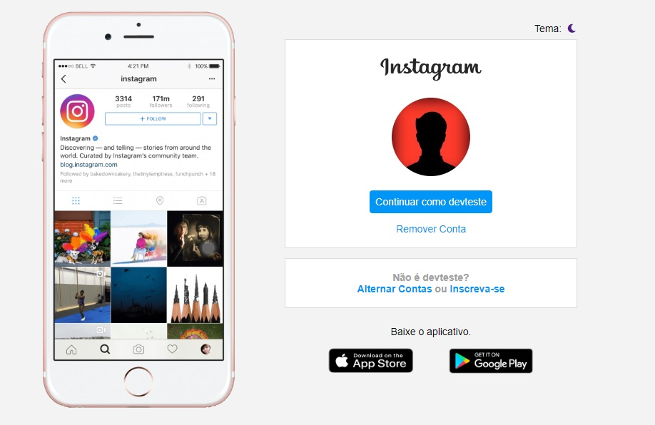

## Recriando a página inicial do Instagram

Foi recriada a página do instagram.

Adicionei à página o modo escuro (darkmode) para praticar CSS, deixar a página mais moderna e dar a opção do usuário escolher entre o tema claro/escuro.

O darkmode foi criado no arquivo style.css através do uso de  variáveis para cores e backgrounds. Na página index.html, um código em javascript faz a verificação inicial no localstorage do navegador para verificar se existe a variável salva com valor ativando o darkmode.

Caso o usuário clique no ícone lua/sol, o darkmode é alternado conforme sugere o ícone, e um código javascript salva a preferência do usuário no localstorage. Assim, caso o usuário feche e abra depois o navegador, a preferência estará gravada para continuar com o tema que estava no momento em que o navegador foi fechado.

